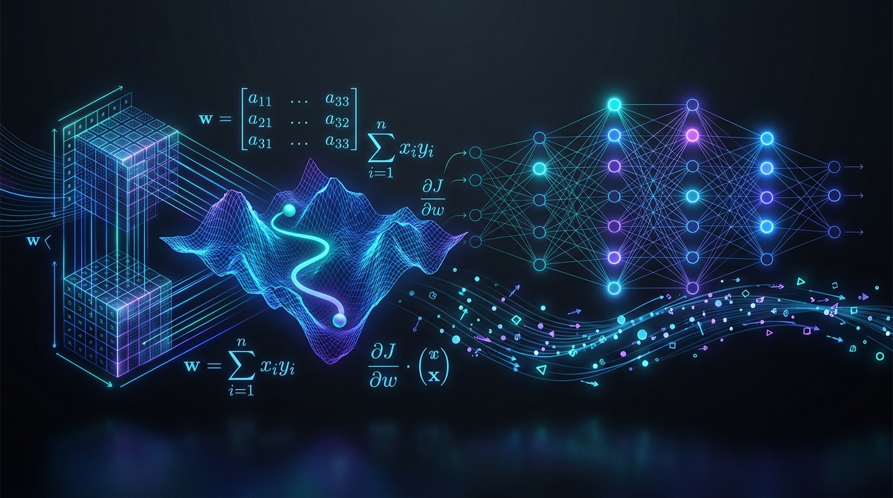
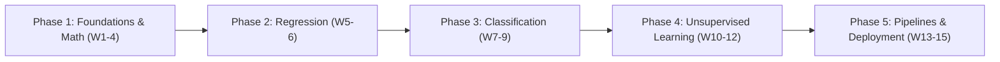

<div align="center">



# 🧠 Machine Learning for Beginners
### *A 15-Week Practical & Mathematical Curriculum*
**Machine Learning from Scratch with Practical Mathematics**

[](https://www.python.org/)
[](https://jupyter.org/)
[](https://numpy.org/)
[](https://scikit-learn.org/)
[](https://streamlit.io/)

</div>

---

## 📌 1. Course Overview

* **Course Title:** Machine Learning from Scratch with Practical Mathematics
* **Level:** Beginner to Intermediate
* **Duration:** 15 Weeks (1 session per week, 2 hours per session = 30 total contact hours)
* **Delivery Mode:** Interactive lectures, mathematical derivations, and hands-on coding labs
* **Core Stack & Environment:** Python, NumPy, Pandas, Matplotlib, Seaborn, Scikit-Learn, Google Colab, Streamlit
* **Prerequisites:** Basic Python programming syntax (variables, functions, loops) and standard high school algebra

---

## 📊 2. Assessment & Grading Structure

| Component | Weight | Description |
| :--- | :---: | :--- |
| **Weekly Coding Tasks & Quizzes** | **40%** | 10 short assignments reinforcing practical lab concepts and mathematical foundations |
| **Mid-Course Project** | **20%** | Conducted at Week 7, covering end-to-end regression or classification pipelines |
| **Final Capstone Project** | **40%** | Complete end-to-end ML system with data pipeline, model training, and web deployment |

---

## 📂 Repository Structure

```plaintext
ML-2/
├── assets/
│   └── banner.jpg                     # Course banner image
├── week1/
│   └── Week_01_Foundations_of_Machine_Learning.ipynb
├── .gitignore                         # Python, Jupyter, Conda, and dataset ignores
└── README.md                          # Course overview and syllabus
```

---

## 🗺️ 3. Weekly Syllabus & Module Breakdown



---

### 🔹 Phase 1: Foundations & Mathematics for ML (Weeks 1 to 4)

#### [Week 01: Introduction to Machine Learning, Life Cycle & Data Representation](week1/Week_01_Foundations_of_Machine_Learning.ipynb)
* **Conceptual Foundations:**
  * Defining AI, Machine Learning, and Deep Learning
  * The Paradigm Shift: Traditional Programming (*Rules + Data = Answers*) vs. Machine Learning (*Data + Answers = Rules*)
  * The End-to-End ML Lifecycle: Problem Formulation, Data Ingestion, EDA, Preprocessing, Modeling, Evaluation, Deployment
* **Problem Typologies:**
  * Supervised Learning (Regression vs. Classification)
  * Unsupervised Learning (Clustering vs. Dimensionality Reduction)
  * Reinforcement Learning overview
* **Mathematical Foundations:**
  * Geometric hierarchy of data: Scalars ($0\text{D}$), Vectors ($1\text{D}$), Matrices ($2\text{D}$), and Tensors ($3\text{D}+$)
  * Standard notation: Samples ($n$), Features ($d$), Feature Matrix $\mathbf{X} \in \mathbb{R}^{n \times d}$, Target Vector $\mathbf{y} \in \mathbb{R}^n$
  * Indexing, row vectors, column vectors, and transposition
* **Hands-on Lab:**
  * Google Colab / Jupyter environment setup & verification
  * Inspecting NumPy arrays (`.shape`, `.ndim`, `.dtype`)
  * Array slicing, separating $\mathbf{X}$ and $\mathbf{y}$ from tabular datasets
  * Reshaping: 1D flat vectors $(n,)$ vs. 2D column vectors $(n, 1)$
  * Benchmark: Vectorization vs. native Python loops

#### Week 02: Linear Algebra for Machine Learning
* **Conceptual Foundations:**
  * Feature spaces and geometric interpretation of data vectors
  * Linear transformations and projections
* **Mathematical Foundations:**
  * Vector addition, scalar multiplication, and geometric angles
  * Vector Dot Product and inner products: algebraic calculation and cosine similarity
  * Matrix multiplication (compatibility rules, dimensional analysis, and intuition)
  * Identity matrix, matrix inverse, and singularity
  * Vector Norms: $L_1$ Norm (Manhattan distance) and $L_2$ Norm (Euclidean distance / magnitude)
* **Hands-on Lab:**
  * Vectorized dot products, matrix multiplications, and transpositions with NumPy (`np.dot`, `@` operator)
  * Implementing Euclidean and Manhattan distance metrics from scratch
  * Numerical image representations as pixel matrices and basic manipulations

#### Week 03: Calculus & Optimization (Gradient Descent)
* **Conceptual Foundations:**
  * How machines learn: Objective functions, Loss functions, and Empirical Risk Minimization
  * Optimization landscape: Convex vs. non-convex optimization, local vs. global minima
* **Mathematical Foundations:**
  * Limits, rates of change, and derivatives
  * Geometric intuition of tangent lines and slopes
  * Partial derivatives and the gradient vector ($\nabla L$)
  * The Gradient Descent update rule: $\mathbf{w} := \mathbf{w} - \alpha \nabla L(\mathbf{w})$
  * Hyperparameter impact of learning rate $\alpha$ (overshooting, oscillations, slow convergence)
* **Hands-on Lab:**
  * Implementing numerical derivatives in Python
  * Coding a 1D Gradient Descent optimization algorithm from scratch
  * Visualizing convergence trajectories on loss surfaces using Matplotlib

#### Week 04: Probability & Statistics for Data Science
* **Conceptual Foundations:**
  * Managing uncertainty and variability in real-world data
  * Population parameters vs. sample statistics
* **Mathematical Foundations:**
  * Measures of Central Tendency: Mean, Median, Mode
  * Measures of Dispersion: Variance, Standard Deviation, Interquartile Range (IQR)
  * Probability distributions: Normal (Gaussian) distribution, 68-95-99.7 empirical rule, Z-scores
  * Covariance, Pearson Correlation Coefficient, and Correlation vs. Causation
  * Introduction to Conditional Probability and Bayes' Theorem
* **Hands-on Lab:**
  * Exploratory Data Analysis (EDA) using Pandas (`.describe()`, `.corr()`)
  * Visualizing statistical distributions with Seaborn (Histograms, KDE plots, Box plots, Heatmaps)

---

### 🔹 Phase 2: Supervised Learning - Regression (Weeks 5 to 6)

#### Week 05: Simple & Multiple Linear Regression
* **Conceptual Foundations:**
  * Modeling continuous dependent variables
  * Ordinary Least Squares (OLS) assumptions (linearity, homoscedasticity, independence, normality)
* **Mathematical Foundations:**
  * Simple Linear model: $\hat{y} = w_1 x + w_0$
  * Multiple Linear model: $\hat{y} = \mathbf{w}^T \mathbf{x} + b$
  * Cost Functions: Mean Squared Error (MSE) and Root Mean Squared Error (RMSE)
  * Analytical Closed-Form Solution (The Normal Equation): $\mathbf{w} = (\mathbf{X}^T \mathbf{X})^{-1} \mathbf{X}^T \mathbf{y}$
  * Trade-offs: Analytical solution vs. Gradient Descent optimization
* **Hands-on Lab:**
  * Implementing Simple Linear Regression from scratch with the Normal Equation
  * Building a Multiple Linear Regression model with Scikit-Learn (`LinearRegression`)
  * Interpreting model coefficients, intercept, and $R^2$ score

#### Week 06: Generalization, Bias-Variance Tradeoff & Regularization
* **Conceptual Foundations:**
  * Underfitting (high bias) vs. Overfitting (high variance)
  * The Generalization Gap and Train/Test split methodology
* **Mathematical Foundations:**
  * Error decomposition: $\text{Error} = \text{Bias}^2 + \text{Variance} + \text{Irreducible Noise}$
  * Complexity penalties in cost functions
  * $L_2$ Regularization (Ridge Regression): $\mathcal{L}_{\text{Ridge}} = \text{MSE} + \lambda \sum w_j^2$
  * $L_1$ Regularization (Lasso Regression): $\mathcal{L}_{\text{Lasso}} = \text{MSE} + \lambda \sum |w_j|$
  * Geometric intuition: Why Lasso drives weights to zero (automatic feature selection)
* **Hands-on Lab:**
  * Dataset partitioning via `train_test_split`
  * Demonstrating polynomial regression overfitting
  * Implementing Ridge and Lasso regularization with Scikit-Learn

---

### 🔹 Phase 3: Supervised Learning - Classification (Weeks 7 to 9)

#### Week 07: Logistic Regression & Classification Evaluation
* **Conceptual Foundations:**
  * Binary classification problems and decision boundaries
  * Why Linear Regression fails for categorical outcomes
* **Mathematical Foundations:**
  * The Sigmoid (Logistic) activation function: $\sigma(z) = \frac{1}{1 + e^{-z}}$
  * Converting linear combinations to probabilities: $P(y=1|\mathbf{x}) = \sigma(\mathbf{w}^T \mathbf{x} + b)$
  * Odds ratio and log-odds (logit transformation)
  * Binary Cross-Entropy Loss (Log Loss): $-\frac{1}{m} \sum [y \log(\hat{y}) + (1-y) \log(1-\hat{y})]$
* **Hands-on Lab:**
  * Training a Logistic Regression model for medical diagnosis (e.g., Diabetes prediction)
  * Confusion Matrix breakdown: TP, FP, TN, FN
  * Evaluating Accuracy, Precision, Recall, and $F_1$-Score
  * Plotting ROC curves, AUC, and Precision-Recall Curves

#### Week 08: Tree-Based Models & Ensemble Learning
* **Conceptual Foundations:**
  * Non-parametric learning and recursive binary splitting
  * Ensemble learning: Wisdom of crowds and variance reduction via bagging
* **Mathematical Foundations:**
  * Information Theory: Shannon Entropy $H(S) = -\sum p_i \log_2(p_i)$
  * Information Gain $= \text{Entropy}(\text{Parent}) - \sum \frac{|S_v|}{|S|} \text{Entropy}(S_v)$
  * Gini Impurity $= 1 - \sum p_i^2$
  * Bootstrap Aggregation (Bagging) mathematics and Random Forest variance reduction
* **Hands-on Lab:**
  * Training `DecisionTreeClassifier` and rendering decision tree diagrams
  * Hyperparameter tuning (`max_depth`, `min_samples_split`)
  * Training `RandomForestClassifier` and plotting Feature Importance rankings

#### Week 09: Distance-Based Classifiers (KNN & Support Vector Machines)
* **Conceptual Foundations:**
  * Instance-based / lazy learning vs. eager parametric models
  * Maximum Margin Classifiers and robust decision boundaries
* **Mathematical Foundations:**
  * K-Nearest Neighbors (KNN): Distance metric selection, choice of $k$, majority voting
  * Support Vector Machines (SVM): Hyperplane equation $\mathbf{w}^T \mathbf{x} + b = 0$, margin calculation $\frac{2}{\|\mathbf{w}\|}$
  * Hard-margin vs. Soft-margin SVM (Slack variables $\xi_i$ and the $C$ penalty parameter)
  * Non-linear separation and the Kernel Trick (Polynomial and RBF kernels)
* **Hands-on Lab:**
  * Implementing KNN with Scikit-Learn and analyzing feature scaling sensitivity
  * Training Linear and RBF Support Vector Classifiers (`SVC`)
  * Comparing 2D decision boundary geometries (KNN vs. Decision Trees vs. SVMs)

---

### 🔹 Phase 4: Unsupervised Learning & Feature Engineering (Weeks 10 to 12)

#### Week 10: Clustering Algorithms & Pattern Discovery
* **Conceptual Foundations:**
  * Unsupervised discovery of clusters without labeled ground truth
  * Industry use cases: Customer segmentation, behavioral cohorting, anomaly detection
* **Mathematical Foundations:**
  * K-Means objective: Minimizing Within-Cluster Sum of Squares (WCSS / Inertia)
  * K-Means convergence algorithm: Assignment step and Centroid update step
  * Determining optimal cluster count: The Elbow Method and Silhouette Score
* **Hands-on Lab:**
  * Implementing K-Means clustering on customer shopping behavioral datasets
  * Plotting inertia curves to evaluate optimal $k$
  * Visualizing cluster assignments and centroids in 2D space

#### Week 11: Dimensionality Reduction (PCA)
* **Conceptual Foundations:**
  * The Curse of Dimensionality: Distance sparsity in high dimensions
  * Feature selection vs. Feature extraction
* **Mathematical Foundations:**
  * Data centering and Sample Covariance Matrix calculation
  * Eigenvalues and Eigenvectors: Geometric interpretation of variance axes
  * Principal Components: Orthogonal projections that maximize preserved variance
  * Explained Variance Ratio calculation
* **Hands-on Lab:**
  * Computing PCA mathematically from scratch with NumPy (`np.cov`, `np.linalg.eig`)
  * Applying Scikit-Learn `PCA` to high-dimensional datasets (30+ features)
  * Projecting data onto 2 components for visual exploration

#### Week 12: Rigorous Validation & Hyperparameter Optimization
* **Conceptual Foundations:**
  * Data leakage prevention and honest model evaluation
  * Hyperparameters (external settings) vs. Model Parameters (learned weights)
* **Mathematical Foundations:**
  * K-Fold Cross-Validation mechanics and estimator variance
  * Stratified K-Fold for imbalanced class distributions
  * Search spaces: Grid Search exhaustive evaluation vs. Random Search probabilistic sampling
* **Hands-on Lab:**
  * Evaluating models using `cross_val_score`
  * Fine-tuning Random Forest and SVM hyperparameters via `GridSearchCV` and `RandomizedSearchCV`
  * Serializing and saving trained models using `joblib` / `pickle`

---

### 🔹 Phase 5: Production Pipelines & Deep Learning Introduction (Weeks 13 to 15)

#### Week 13: Feature Engineering, Preprocessing & Scikit-Learn Pipelines
* **Conceptual Foundations:**
  * Handling real-world messy data: Missingness, categorical variables, differing scales
  * Designing modular, production-grade transformation pipelines
* **Mathematical Foundations:**
  * Feature Scaling: Standardization ($z = \frac{x - \mu}{\sigma}$) vs. Min-Max Normalization ($x' = \frac{x - x_{\min}}{x_{\max} - x_{\min}}$)
  * Categorical encodings: One-Hot Encoding vs. Ordinal/Integer Encoding
  * Imputation mechanics: Mean, Median, Mode, and KNN imputation
* **Hands-on Lab:**
  * Building `ColumnTransformer` pipelines for heterogeneous data types
  * Chaining transformers and estimators inside Scikit-Learn `Pipeline`
  * Demonstrating strict isolation: `fit_transform` on train, `transform` on test to prevent data leakage

#### Week 14: Introduction to Deep Learning & Artificial Neural Networks
* **Conceptual Foundations:**
  * The paradigm transition from classical ML to Deep Learning
  * Biological vs. Artificial Neurons
  * Multilayer Perceptron (MLP) architecture: Input, Hidden, and Output layers
* **Mathematical Foundations:**
  * Single artificial neuron equation: $z = \sum w_i x_i + b, \quad a = f(z)$
  * Non-linear activation functions: Sigmoid, ReLU, Tanh, Softmax
  * Forward Propagation matrix equations
  * Intuition of Backpropagation and the Calculus Chain Rule
* **Hands-on Lab:**
  * Training a Multilayer Perceptron with Scikit-Learn (`MLPClassifier`)
  * Handwritten digit classification on the MNIST dataset
  * Analyzing loss curves and convergence rates across epochs

#### Week 15: Capstone Project Showcase & Deployment
* **Capstone Project Objectives:**
  * Integrating all 14 weeks of knowledge into a complete end-to-end data application
* **Execution Steps:**
  1. Problem formulation and dataset curation (e.g., Credit Default, Customer Churn, Real Estate Valuation)
  2. Exploratory Data Analysis, outlier detection, and data cleaning
  3. Preprocessing pipeline implementation with `ColumnTransformer`
  4. Training, tuning, and benchmark comparison of multiple candidate algorithms
  5. Model selection via cross-validated evaluation metrics
  6. Exporting the finalized pipeline artifact
  7. Creating a real-time web application interface with **Streamlit**
* **Course Wrap-Up & Industry Roadmaps:**
  * Next steps: Transitioning to PyTorch and TensorFlow
  * Introduction to MLOps, Model Monitoring, and cloud deployment (Hugging Face Spaces, Docker, AWS)
  * Building your Kaggle and GitHub data science portfolio

---

## ⚡ Quickstart & Environment Setup

### 1. Clone the Repository
```bash
git clone <your-repo-url>
cd ML-2
```

### 2. Set Up a Virtual / Conda Environment
```bash
# Using Conda
conda create -n ml-curriculum python=3.10 -y
conda activate ml-curriculum

# Install Core ML Dependencies
pip install numpy pandas matplotlib seaborn scikit-learn jupyter streamlit
```

### 3. Launch Jupyter Lab / Notebook
```bash
jupyter notebook
```
Navigate to `week1/Week_01_Foundations_of_Machine_Learning.ipynb` to start the first lab!

---

<div align="center">
  <sub>Designed for aspiring Data Scientists & Machine Learning Engineers. Happy Learning!</sub>
</div>
